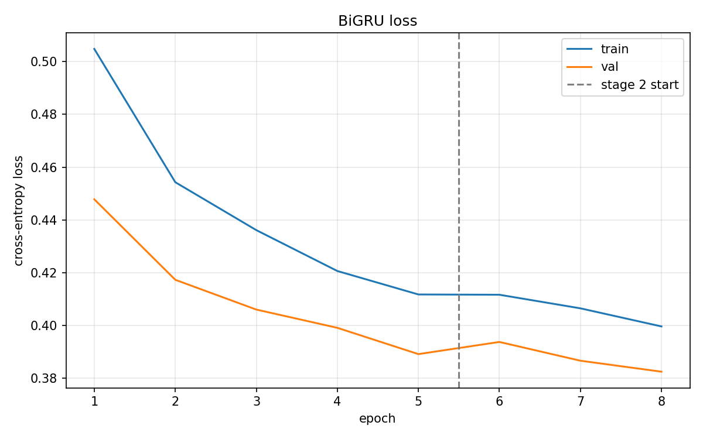
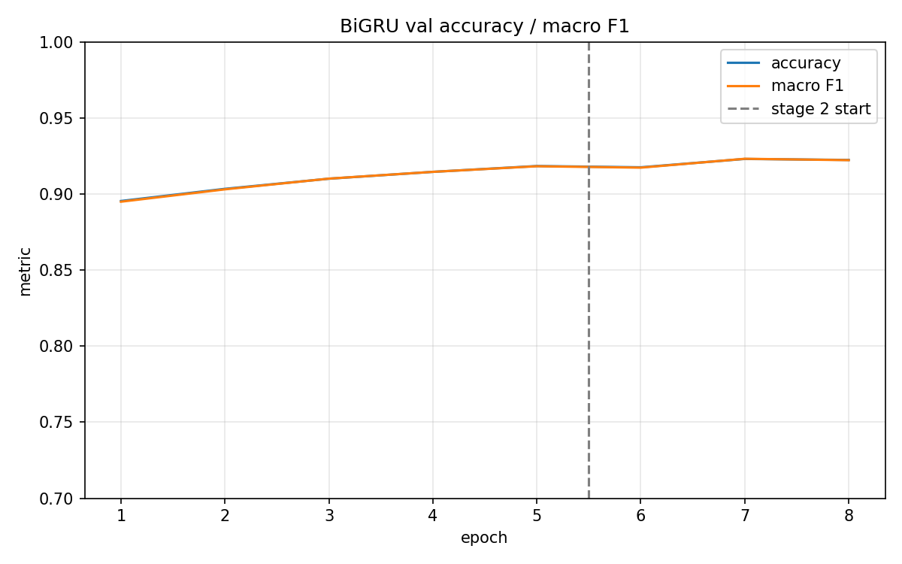
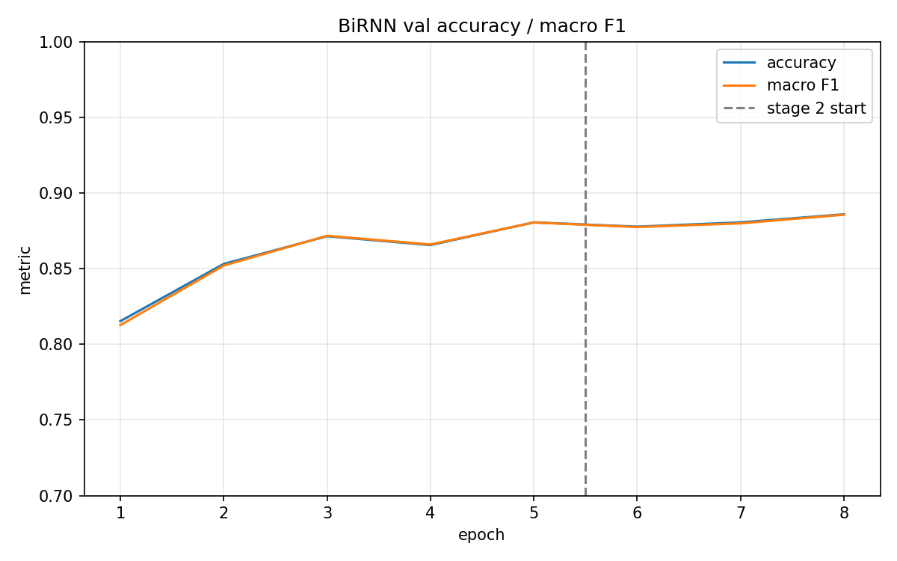
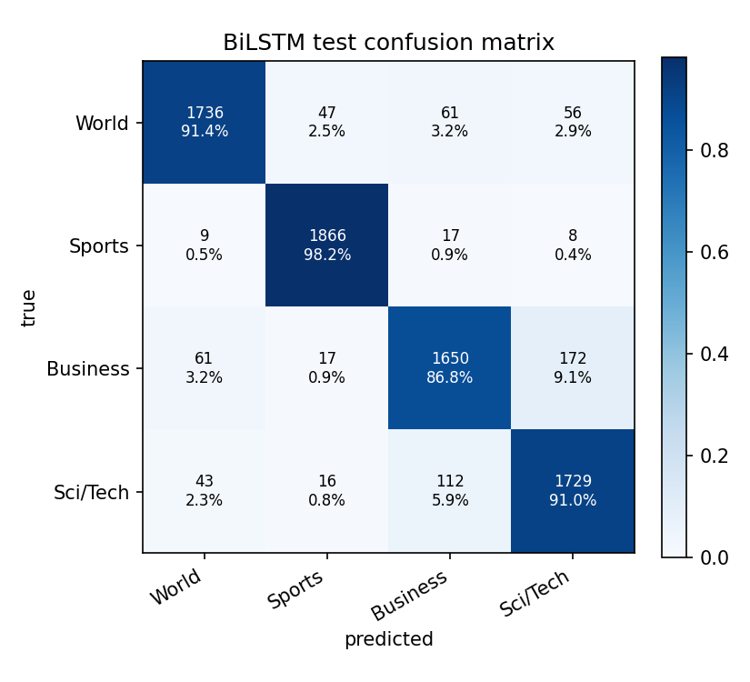

# RNN Topic Classification on AG News

本仓库 text 方向的第二个项目。任务从 **二分类情感** 换成 **四分类主题**，模型仍是
vanilla RNN / GRU / LSTM 三者对比，整体结构完全沿用同级的 `../SST-2`：

```
embedding (GloVe, backbone) -> RNN encoder (neck) -> pooling + linear (head)
两阶段分层学习率微调 + 每轮 JSON 日志 + 曲线图 + 最佳 checkpoint
```

---

## 实验结果

| 指标 | 结果 |
|---|---:|
| Test Accuracy | **0.9192** |
| Test Macro F1 | **0.9192** |
| 最佳 epoch | **7 / 8**（按 val 选） |
| 模型参数量 | **6.30M**（其中 embedding 4.56M） |
| 训练时间 | **4.3 分钟**（8 epochs，单卡） |

最佳配置：`BiGRU + GloVe 6B.100d + last pooling`，两阶段 5 + 3 epochs。

> **划分协议**：AG News 的 test 标签是公开的，所以本项目从 train 中分层切出 5%
> 作为 val，**只用 val 选 checkpoint**，test 只在最后由 `eval.py` 读一次。
> 上表是 test（7,600 篇）的结果。

---

## 三种 cell 对比

完全单变量：同一词表（45,618）、同一 GloVe 初始化、同一 last pooling、同一 loss、
同一 5 + 3 epochs 调度、同一 seed（42），只换 `--cell`。

| 模型 | Test Acc | Test Macro F1 | Val Acc | 最佳 epoch | 总参数 | encoder 参数 | s/epoch | 总时长 |
|---|---:|---:|---:|---:|---:|---:|---:|---:|
| BiRNN（vanilla） | 0.8876 | 0.8874 | 0.8860 | 8 | 5.14M | 0.58M | 28.6 | 3.8 min |
| **BiGRU** | **0.9192** | **0.9192** | 0.9232 | 7 | 6.30M | 1.73M | 32.0 | 4.3 min |
| BiLSTM | 0.9186 | 0.9184 | 0.9205 | 8 | 6.87M | 2.31M | 29.6 | 3.9 min |

排序是 **{GRU ≈ LSTM} >> RNN**，注意**不是**教科书里的 LSTM > GRU > RNN。下面四个
观察才是这次实验真正的内容。

### 1. 门控确实在长序列上拉开了差距 —— 而且比 SST-2 大一个数量级

这是本项目立项时的核心问题，答案很干脆：

| | 序列中位长度 | LSTM/GRU 相对 RNN 的最大领先 |
|---|---|---|
| SST-2 | train 7 词 / dev 20 词 | **+1.95** 个百分点（LSTM 0.8647 vs RNN 0.8452） |
| **AG News** | **44 词** | **+3.16** 个百分点（GRU 0.9192 vs RNN 0.8876） |

换算成错误数更直观：**RNN 错 854 篇，GRU 错 614 篇，少了 28.1%**。

在文档变长、且用 `last` pooling（每个预测都依赖一个走完全程的隐状态）的设定下，
vanilla RNN 的记忆半径成了真正的瓶颈。这与理论预期一致。

**这里要坦白一件事**：动手前我的预测是「三者会挤在 1 个点以内」，理由是 AG News
主题分类接近纯词汇任务（词袋基线就有 ~88.8%）。**这个预测错了**，门控的收益比我
估计的大得多。

### 2. GRU 和 LSTM 的差距是噪声，不要解读

GRU 0.9192 vs LSTM 0.9186，差 **0.06 个百分点 = 7600 篇里 5 篇**。

**单 seed 单次运行，这个差距没有任何意义。** 不能说"GRU 比 LSTM 好"。能说的只有
「在这个配置下两者打平，而 LSTM 多用了 0.57M 参数」。

对照 SST-2 上 LSTM 领先 GRU 1.49 个点 —— 那同样是单 seed，同样不可靠。两个数据集
放在一起看，**唯一稳健的结论是「门控 > 无门控」，门控内部的排序需要多 seed 才能谈**。

### 3. 收敛速度的差距比终点差距更夸张

| 模型 | epoch 1 | 8 轮后 |
|---|---:|---:|
| BiRNN | 0.8153 | 0.8860 |
| BiGRU | **0.8955** | 0.9232 |
| BiLSTM | **0.8968** | 0.9205 |

**GRU / LSTM 第一轮就超过了 RNN 训练八轮的最终成绩。** RNN 花了整整 8 轮爬到 0.8860，
门控 cell 一轮就到 0.895+。

这和 SST-2 上的观察同向（那边也是"差距主要体现在收敛速度"），但幅度大得多。

### 4. 三者都在 stage 2 第一轮掉一下，然后反超

| 模型 | stage 1 末（ep5） | stage 2 首轮（ep6） | 最终最佳 | stage 2 净收益 |
|---|---:|---:|---:|---:|
| BiRNN | 0.8807 | 0.8778 ↓ | 0.8860 | +0.53 |
| BiGRU | 0.9185 | 0.9177 ↓ | 0.9232 | +0.47 |
| BiLSTM | 0.9177 | 0.9160 ↓ | 0.9205 | +0.28 |

**三个模型无一例外**：解冻 embedding 的第一轮准确率先掉，随后两轮才涨回来并超过。
这就是分层学习率要解决的问题 —— 4.56M 个预训练词向量突然开始接受梯度，哪怕
lr 只有 5e-5，几何结构还是会被扰动一下。

对比 SST-2：那次**只有 RNN 受到 stage 2 冲击**，GRU/LSTM 没有。这次三个都掉，
大概是因为这里 embedding 占参数的 66%（SST-2 只有 37%），扰动的相对影响更大。

净收益 +0.3 ~ +0.5 个点，stage 2 是划算的，但不惊人。

### 5. 每轮耗时几乎相同（同 SST-2）

28.6 / 32.0 / 29.6 秒，而 encoder 参数是 1 : 3 : 4。**注意 RNN 并不是最快的**，
GRU 反而最慢 —— 说明这个规模下差异已被运行间波动淹没（单个 LSTM 内部的每轮耗时
就在 25.4 ~ 37.8 秒之间跳）。

通行的解释是瓶颈在序列的时间步数（无法并行）而非每步的浮点运算量，cuDNN 把三者
的差异抹平了。**但这是推断，不是本项目实测** —— 这里的耗时包含数据加载、评测、
Python 开销，我没有单独给 encoder 计时。能确证的只有「cell 的算力差异不是瓶颈」。

---

## 为什么在 SST-2 之后再做 AG News

不是为了换一个数据集刷分，而是这四个差异各自会改变一件事：

| | SST-2 | AG News |
|---|---|---|
| 任务 | 2 类情感 | 4 类主题（World / Sports / Business / Sci/Tech） |
| 规模 | 67k 片段，train 中位 7 词 / dev 中位 20 词 | 120k 新闻，中位 44 词 |
| 类别平衡 | 44 / 56 | 精确 25 / 25 / 25 / 25 |
| test 标签 | 不公开 | **公开** |

1. **序列变长** → 门控 cell 该拉开差距。**结论：确实拉开了，+3.16 个点。**（观察 1）
2. **类别数 2 → 4** → 混淆矩阵从「错多少」变成「哪两类在混」。**结论：Business ↔
   Sci/Tech 占了将近一半的错误。**（见下方完整结果）
3. **完全平衡** → 准确率不可能被多数类捷径抬高，随机基线干净地等于 0.25。
4. **test 标签公开** → 必须自建验证集，见下一节。

---

## 划分协议：为什么多了一个 val

SST-2 的 test 标签由 GLUE 服务器保管，所以「用 dev 选 checkpoint」和「报告 dev」
是同一件事，不存在泄漏空间。AG News 把带标签的 test 直接给了你——如果每轮都在
test 上评估、再挑最好的一轮，那个「test 准确率」就变成了 N 次抽样里的最大值，
不再是泛化估计。

所以本项目从 train.csv 中分层切出 5%：

| 划分 | 数量 | 用途 |
|---|---|---|
| train | 114,000 | 梯度更新 + 建词表 |
| val | 6,000 | 每轮曲线、选 `best.pt` |
| test | 7,600 | **只在最后由 `eval.py` 读一次** |

切分由 `config.SPLIT_SEED = 1234` 控制，**与训练种子 `config.SEED` 分开**：换训练
种子看波动时，被评测的那 6000 条文档不能跟着动。分层切分保证 val 也是精确的
25/25/25/25。

**这个协议起作用了。** val 与 test 的差距很小，说明 val 没有被选 checkpoint 的动作
榨干：

| 模型 | Val | Test | 差 |
|---|---:|---:|---:|
| BiRNN | 0.8860 | 0.8876 | **+0.16** |
| BiGRU | 0.9232 | 0.9192 | −0.40 |
| BiLSTM | 0.9205 | 0.9186 | −0.19 |

RNN 的 test 甚至比 val 还高。如果当初直接在 test 上选 checkpoint，报出来的数字会
系统性偏高，而且没人看得出来偏了多少。

---

## 数据集

AG News（Zhang, Zhao & LeCun 2015），新闻标题 + 首段，四个主题各 30,000 条训练样本。

原始格式是无表头的三列 csv：

```
"3","Wall St. Bears Claw Back Into the Black (Reuters)","Reuters - Short-sellers, Wall Street's dwindling\band of ultra-cynics, are seeing green again."
 ^   ^                                                  ^
 |   title                                              description
 类别，1-based：1=World 2=Sports 3=Business 4=Sci/Tech
```

本项目取 `title + ". " + description` 作为输入文本，类别减 1 变成 0-based。

### 两处必须修的抓取损伤

这份语料是从网页抓的，转义序列烂在了里面。**实测（120,000 条训练样本）：**

| 问题 | 出现比例 | 不处理的后果 |
|---|---|---|
| 换行被写成字面反斜杠 `dwindling\band` | 11.0% | 分词得到 `dwindlingband`，一个 GloVe 里没有的词 |
| HTML 实体丢了 `&`，只剩 `#39;` | **24.75%** | `Arsenal #39;s` → `['arsenal','#','39',';','s']` |
| `&lt;strong&gt;` 之类的标签 | 4.4% | 解转义后变成 `<strong>` 继续污染 |

`#39;` 这条最要命：**四分之一的文档**里，本该是一个撇号的位置塞进了三个垃圾
token。全语料统计是 47k 个 `#`、45k 个 `39`、87k 个 `;`、10k 个 `quot`，约占
全部 token 的 4%——RNN 得一步一步走过去。

注意 `html.unescape()` 单独用是修不好的：`&lt;` / `&gt;` 保留了 `&`，而 `&#39;` /
`&quot;` 丢了，所以 `dataset/ag_news.py:_ENTITY_RE` 用 `&?` 同时兼容两种写法。

**清洗的实测代价 ≈ 0**：GloVe token 级覆盖率 98.97% → 98.83%。这个数字几乎不动，
恰恰说明**覆盖率是个很差的质量指标**——`#`、`39`、`;` 本身都在 GloVe 里，所以
它们一直被算作「找到了」。

清洗后的效果：

```
Arsenal #39;s 100 per cent record   →   Arsenal 's 100 per cent record
```

顺带一提，替换后 `'s` 自然独立成词（原文 `#39;` 前有空格），正好符合 GloVe 6B
所用的 PTB 风格分词习惯，也和 SST-2 语料里已经预分好的 `it 's` 一致。

**刻意没做**：小写化（归分词器管）、停用词过滤、词干还原（后两者扔掉的正是循环
模型该用的信号）。

### 处理后的实测统计

```
词表大小          45,618        (min_freq=2)
train  114,000    <unk> 0.47%   长度 mean 45.6  median 44  p99 97  max 253
val      6,000    <unk> 0.91%   长度 mean 45.9  median 44  p99 99
test     7,600    <unk> 0.90%   长度 mean 45.2  median 44  p99 95
GloVe 覆盖        41,035/45,618 = 90.0% (type)   98.83% (token)
MAX_LEN=128 截断  411 / 114,000 = 0.36%
```

`min_freq=2`（SST-2 用的是 1）：这份语料 token 数是 SST-2 的约 18 倍，原始 type
数被只出现一次的词主导——拼写错误、一次性人名、股票代码，靠一次出现本来也学不出
东西。丢掉它们让 embedding 表几乎减半，而且让真实训练样本走 `<unk>` 通道，那个
向量因此得到训练，而不是停在随机初始化上。

### 一条已知的数据瑕疵

train.csv 内部有 **2 条完全重复的文档**（120,000 条中）。其中一条的两份分别落进
了 train 和 val，所以 `dataset/ag_news.py` 的自检会报 `val documents also present
in train: 1`。这是语料本身的重复，不是切分 bug，6000 条里占 0.017%，不作处理。

---

## 模型结构

```
ids [B, L]  (L = 该 batch 内最长文档，动态 padding)
  │
  ├─ TokenEmbedding        45,618 x 100，GloVe 初始化，padding_idx=0
  │    └─ Dropout(0.5)
  │  vectors [B, L, 100]
  │
  ├─ RNNEncoder            2 层双向，hidden=256/方向
  │    pack_padded_sequence → RNN/GRU/LSTM → pad_packed_sequence
  │  outputs [B, L, 512]   final [B, 512]
  │
  └─ ClassifierHead        pooling(last/max/mean) → Dropout(0.5) → Linear
     logits [B, 4]
```

**结构与 SST-2 完全一致**（`embed_dim=100`、`hidden=256`、`2 层`、`双向`、
`dropout=0.5`、`last pooling`），`model/` 下四个文件是同一套代码。变的只有两端：
类别数 2→4、词表 13,846→45,618、MAX_LEN 64→128。

### 参数量（实测）

| cell | 总参数 | encoder | embedding | stage-1 可训练 |
|---|---|---|---|---|
| BiRNN | 5.14M | 0.58M | 4.56M | 0.58M |
| BiGRU | 6.30M | 1.73M | 4.56M | 1.73M |
| BiLSTM | 6.87M | 2.31M | 4.56M | 2.31M |

encoder 的 1 : 3 : 4 比例来自门的数量（RNN 一组权重，GRU 三组，LSTM 四组）。

值得注意的是 **embedding 表（4.56M）比 encoder 还大，占总参数的 66%**——模型的
大部分其实是一本词典（SST-2 上只占 37%）。stage 1 冻结它，正是为了在 encoder 还
不会读的时候，先别让梯度去改写词典。观察 4 里三个模型都在 stage 2 首轮掉点，
根源也在这个比例。

### Packing 与 masked pooling

和 SST-2 项目完全一致，两个陷阱都在 `model/encoder.py` 与 `model/head.py` 里有
详细注释：

- **不 pack**：`final` 会变成「走完 k 步 padding 之后的状态」，每个长度都不一样。
- **max pooling 不 mask**：padding 位置是 0，只要真实激活是负的，0 就会赢下 max。

`model/encoder.py` 的自检直接验证了三条不变量（padding 位置为 0、`final` 等于最后
一个真实 token 处的输出、加更多 padding 结果不变）。

---

## 训练配置

| | 值 | 与 SST-2 的差异 |
|---|---|---|
| optimizer | Adam, weight_decay 1e-4 | 同 |
| batch size | 128 | SST-2 是 64。文档量 ×1.7、长度 ×4，一轮约 10 倍工作量 |
| grad clip | 5.0 | 同（序列长 4 倍，BPTT 的指数更大，更不能省） |
| label smoothing | 0.05 | 同。4 类的软目标是 (0.95, 0.0167, 0.0167, 0.0167) |
| dropout | 0.5 | 同——**实测偏大，见下方曲线分析** |
| MAX_LEN | 128 | SST-2 是 64 且从未触发；这里真的会截断 0.36% |
| seed | `--seed` 可传 | SST-2 写死 42，这次补上了 |

损失就是 `nn.CrossEntropyLoss(label_smoothing=0.05)`，**直接写在 `train.py` 里，
没有 `losses/` 包**。SST-2 那边为了一行 CE 包了一个类，这次去掉了：每篇文档只有
一个预测，没有要忽略的位置，没有辅助头，也不需要类别权重（语料精确平衡），
包装类没有承担任何东西。相应地 `train_one_epoch` 直接返回一个 float，原来那套
多分量损失的 dict 累加也一并删了。

### 两阶段

```
Stage 1 (5 轮)  冻结 embedding，head/encoder 同一档 lr=1e-3
                → 让随机初始化的 RNN 先学会读固定的 GloVe 向量
Stage 2 (3 轮)  解冻全部，三档分层 lr：
                head 3e-4  >  encoder 3e-4  >  embedding 5e-5
                → 预训练词向量只做轻微漂移，不被冲垮
```

每一档都套 `CosineAnnealingLR`。

### 复现命令

一条命令跑完三个 cell 的训练与 test 评测（PowerShell）：

```powershell
conda activate dev
.\run_all.ps1
```

或者手动：

```bash
python train.py --cell rnn
python train.py --cell gru
python train.py --cell lstm

python eval.py --cell rnn  --split test --save-cm
python eval.py --cell gru  --split test --save-cm
python eval.py --cell lstm --split test --save-cm
```

首次运行会自动下载 AG News（11 MB）。**GloVe 不会重复下载**——`config.py` 会先扫
描同级项目的 `dataset/data/`，找到 `../SST-2/dataset/data/glove/glove.6B.100d.txt`
就直接用。

看错在哪里：

```bash
python predict/predict.py --cell gru --test-mistakes 20
python predict/predict.py --cell gru --text "Arsenal beat Chelsea 2-1 at the Emirates"
```

单独准备 / 检查数据（不训练）：

```bash
python dataset/ag_news.py --download    # 下载 + 打印各 split 统计
python dataset/glove.py                 # 打印 GloVe 覆盖率与词向量语义自检
```

---

## 训练曲线

### BiGRU Loss（最佳模型）



### BiGRU Accuracy / Macro F1



### BiRNN Accuracy（对比：起点低得多，且一直在爬）



### 曲线分析：**训练不足，而不是过拟合**

三个模型在第 8 轮的 loss：

| 模型 | train_loss | val_loss | 关系 |
|---|---:|---:|---|
| BiRNN | 0.5176 | 0.4700 | train **>** val |
| BiGRU | 0.3995 | 0.3824 | train **>** val |
| BiLSTM | 0.3974 | 0.3848 | train **>** val |

**三个模型的训练损失自始至终都高于验证损失，两条线从未交叉。** 这是强正则化的
典型特征——dropout 在训练时生效、评测时关闭，所以训练损失被人为抬高了。

结合 val loss 到最后一轮仍在下降（GRU 0.3865 → 0.3824），可以确定：

- **8 轮给少了**，模型还没到平台期；
- **dropout 0.5 对 114k 篇文档偏大**，这个值是从 67k 短片段的 SST-2 直接抄来的，
  当时是必要的，这里可能在白白限制容量。

这两条都是下一步该做的（见「下一步」），本轮结论里的绝对数字因此应视为
**这个预算下的下界**，而不是这些架构的上限。

---

## 完整 test 结果

### BiGRU（最佳模型，7,600 篇）

| class | prec | recall | f1 | support |
|---|---:|---:|---:|---:|
| World | 0.9362 | 0.9189 | 0.9275 | 1900 |
| Sports | 0.9728 | 0.9784 | 0.9756 | 1900 |
| Business | 0.8894 | 0.8716 | 0.8804 | 1900 |
| Sci/Tech | 0.8792 | 0.9079 | 0.8933 | 1900 |
| **accuracy** | | | **0.9192** | 7600 |
| **macro F1** | | | **0.9192** | |


### 错误结构：一半的错误是同一对类别

| 模型 | 总错误 | Business ↔ Sci/Tech | 占比 | World ↔ Business | World ↔ Sci/Tech | 涉及 Sports |
|---|---:|---:|---:|---:|---:|---:|
| BiRNN | 854 | 382 | 44.7% | 181 | 127 | 164 |
| BiGRU | 614 | **292** | **47.6%** | 129 | 100 | 93 |
| BiLSTM | 619 | 284 | 45.9% | 122 | 99 | 114 |

**Business 和 Sci/Tech 互相混淆，占了将近一半的错误。** 这不是模型的缺陷，而是
标注本身的模糊：一篇讲芯片厂财报、电信运营商并购、或者互联网公司股价的新闻，
放进哪一类都说得通。AG News 只给了单标签。

值得注意的是从 RNN 到 GRU，**这一对的错误绝对数下降了（382 → 292），但占总错误的
比例反而上升（44.7% → 47.6%）**。也就是说门控 cell 多出来的准确率主要来自修好其它
类别，这对真正困难的类别改善最少 —— 因为它们的困难来自标签歧义，不是来自记忆长度。

另一头，**Sports 几乎被解决了**：F1 0.9756，只有 93 个错误涉及它。体育新闻的词汇
（球员名、比分、联赛）与其余三类几乎不相交。

### 三个模型的混淆矩阵

| BiRNN | BiGRU | BiLSTM |
|---|---|---|
|  |  |  |

---

## 实验结论

1. **门控 > 无门控，在长文档上尤其明显。** GRU/LSTM 比 vanilla RNN 高 3.16 个点，
   错误少 28%。序列从 SST-2 的中位 20 词变成 44 词后，差距从 1.95 个点扩大到
   3.16 个点。**这条推翻了我动手前"三者会挤在 1 个点以内"的预测。**
2. **GRU 与 LSTM 打平**（0.9192 vs 0.9186，差 5 篇文档）。单 seed 下这不构成排序，
   但 GRU 少用 0.57M 参数达到同样效果，是更划算的默认选择。
3. **收敛速度的差距比终点差距更大**：门控 cell 第 1 轮就超过 RNN 训练 8 轮的成绩。
4. **两阶段微调有效但收益不大**（+0.3 ~ +0.5 个点），且三个模型无一例外在解冻的
   第一轮先掉点再涨回来。
5. **错误高度集中在 Business ↔ Sci/Tech**（约一半），且这部分改善最少——它来自
   标签歧义而非模型能力。
6. **本轮训练不足**：train loss 始终高于 val loss，val loss 到最后一轮仍在降。
   报告的数字是这个预算下的下界。

### 一个必须说明的参照

回想公开报告的经典基线（**以下为文献记忆值，非本项目实测**）：词袋约 88.8%，
ngrams TF-IDF 约 92.4%，fastText 约 92.5%，BERT-base 微调约 94.5%。

也就是说，**本项目最好的 BiGRU（91.92%）大致与词袋/ngram 类方法持平，甚至可能略低
于 ngrams TF-IDF**。这与「主题分类很大程度上是词汇任务」的直觉一致：一个双向 GRU
读完 44 个词，并没有比统计词频高明多少。

要判断循环结构究竟贡献了多少，**必须自己跑一个 bag-of-words 下界 baseline**——
这是本项目最大的缺口，见下一步。

---

## 已知限制

- **单 seed。** `--seed` 已经支持但只跑了 42 这一个。GRU 与 LSTM 的 0.06 个点差距
  完全没有意义；「门控 > RNN」的 3.16 个点足够大，相对可信。
- **训练预算不足**（见曲线分析）：8 轮未到平台期，dropout 0.5 可能偏大。
- **只测 last pooling。** `max` / `mean` 已实现但未做对照。对 44 词的文档，
  `max` 很可能更强（一个决定性词就该能带动预测）。
- **没有非 RNN 下界 baseline**——这是最要紧的缺口，见上面「一个必须说明的参照」。
- **没有 GloVe 消融。** `--no-glove` 可用，但注意 SST-2 项目里发现的坑：
  `--no-glove` 走 `nn.Embedding` 默认的 `N(0,1)` 初始化，而 GloVe 向量的
  per-dim std ≈ 0.53、未命中词是 `N(0,0.1)`，**尺度并不对齐**，这个消融要先修
  初始化才有意义。本项目沿用了同样的代码，同样的坑还在。
- GloVe 只用了 100d，未试 300d。
- 未做 early stopping，轮数靠手动指定。
- dropout / hidden size / 层数全部直接沿用 SST-2 的值，未针对本任务调过。

### 环境已知问题：cuDNN RNN 退出崩溃

本机（Windows 11 + torch 2.11.0+cu128 + cuDNN 9.19）上，**用过带 dropout 的
cuDNN RNN 且处于 train 模式的进程，退出时必崩**：

```
STATUS_STACK_BUFFER_OVERRUN   0xC0000409   exit code -1073740791
```

崩在 `main()` 返回之后的 DLL 卸载阶段，**所有 checkpoint / 日志 / 图片都已经写完
落盘**，结果完全有效。二分定位到的触发条件是 cuDNN 的 dropout state descriptor：

| 条件 | 退出码 |
|---|---|
| `nn.LSTM(dropout=0.5).cuda().train()` + 一次前向 | **崩** |
| 同上但 `dropout=0.0` | 0 |
| 同上但 `.eval()` | 0 |
| 同上但 `cudnn.enabled = False` | 0 |
| 同上但在 CPU | 0 |

这解释了为什么 `train.py` 崩而 `eval.py` 不崩 —— 后者调了 `model.eval()`，
descriptor 根本没被创建。同样的代码在 SST-2 项目里也会崩（已验证），只是当时
一条条手敲命令，没人看退出码，所以从未被发现。

修复见 `train.py:clean_exit()`：三个入口的末尾都改走 `TerminateProcess`。注意
**`os._exit()` 不管用** —— 它在 Windows 上最终调到 `ExitProcess`，仍然会执行
`DLL_PROCESS_DETACH`，而崩溃正是发生在那里（实测依旧 -1073740791）。

没有采用的替代方案：关掉 cuDNN 可以修好，但实测慢 2.7 倍（本项目的 encoder 形状，
BiLSTM 2×256、batch 128、96 步：41.4 ms/step → 112.2 ms/step），等于整个训练预算；
把 RNN 的 dropout 设成 0、改用手动堆叠单层 RNN 加 `nn.Dropout` 也可行，但为了一个
纯粹表面的问题去改模型代码不值得。

---

## 下一步

### 1. bag-of-words 下界 baseline（最优先）

TF-IDF + 逻辑回归，几十行、几秒钟。**如果它就有 91%，那本项目的 BiGRU 等于白跑**，
循环结构的价值被证伪；如果只有 87%，那 4 个点就是序列建模的真实贡献。
不做这一步，上面所有结论都缺一个尺度。

### 2. 加长训练 + 调小 dropout

曲线明确显示训练不足。建议 `--epochs-stage1 12 --epochs-stage2 6` 配合
`config.DROPOUT = 0.3` 再跑一轮，并用 `--output-dir` 另存以便对比。

### 3. 多 seed

至少 3 个 seed，报告均值 ± 标准差。当前 GRU 与 LSTM 的排序毫无统计意义。

### 4. max pooling 对照

44 词的文档用 `last` pooling 是最苛刻的设定，`--pooling max` 大概率更强。

### 5. 错误样本分析

`python predict/predict.py --cell gru --test-mistakes 30`，重点看那 292 条
Business ↔ Sci/Tech 里有多少是标注本身就有歧义的。

---

## 文件结构

```
AG-News/
├── config.py                 所有超参与路径；GloVe 跨项目复用的扫描逻辑
├── dataset/
│   ├── ag_news.py            下载、csv 解析、清洗、分层切分、Dataset、collate
│   ├── vocab.py              分词器 + 词表（与 SST-2 保持一致，故覆盖率可比）
│   ├── glove.py              GloVe 下载 + 构建 embedding 矩阵
│   └── data/                 语料（gitignore）
├── model/
│   ├── embedding.py          backbone：词向量表 + freeze/unfreeze
│   ├── encoder.py            neck：RNN/GRU/LSTM + packing
│   ├── head.py               head：masked pooling + linear
│   └── rnn_classifier.py     三者拼装 + parameter_groups()
├── utils/
│   ├── download.py           多连接断点续传（新增 extract_tar）
│   ├── metrics.py            混淆矩阵 → accuracy / per-class P-R-F1 / macro-F1
│   └── viz.py                预测行格式化 + 混淆矩阵热力图
├── train.py                  两阶段训练主入口（损失内联，无 losses/ 包）
├── eval.py                   在 test/val/train 上评测某个 checkpoint
├── predict/predict.py        推理：自由文本 / 文件 / 随机 test / 错误样本
├── run_all.ps1               串行跑完三个 cell 的训练 + test 评测
└── README.md
```

与 SST-2 的结构差异只有两处，都是刻意的：**没有 `losses/` 包**（一行 CE 不值得
包类），以及 `dataset/` 里多了一个分层切分函数（因为 test 标签公开）。

---

## 输出文件

每个 cell 一个目录（`outputs_rnn/` `outputs_gru/` `outputs_lstm/`）：

| 文件 | 内容 |
|---|---|
| `best.pt` | val 准确率最高的那一轮权重 |
| `vocab.json` | 该次训练用的词表（gitignore；缺失时可确定性重建） |
| `training_log.json` | `meta`（完整配置、GloVe 覆盖率、起止时间、best_val、final_val）+ `history`（每轮 loss/acc/macro-F1/各档 lr/耗时） |
| `loss_curve.png` | train vs val 交叉熵，虚线标 stage 2 起点 |
| `acc_curve.png` | val 准确率与 macro-F1 |
| `confusion_matrix.png` | 最佳 checkpoint 在 **val** 上的混淆矩阵 |
| `confusion_matrix_test.png` | `eval.py --split test --save-cm` 生成 |
