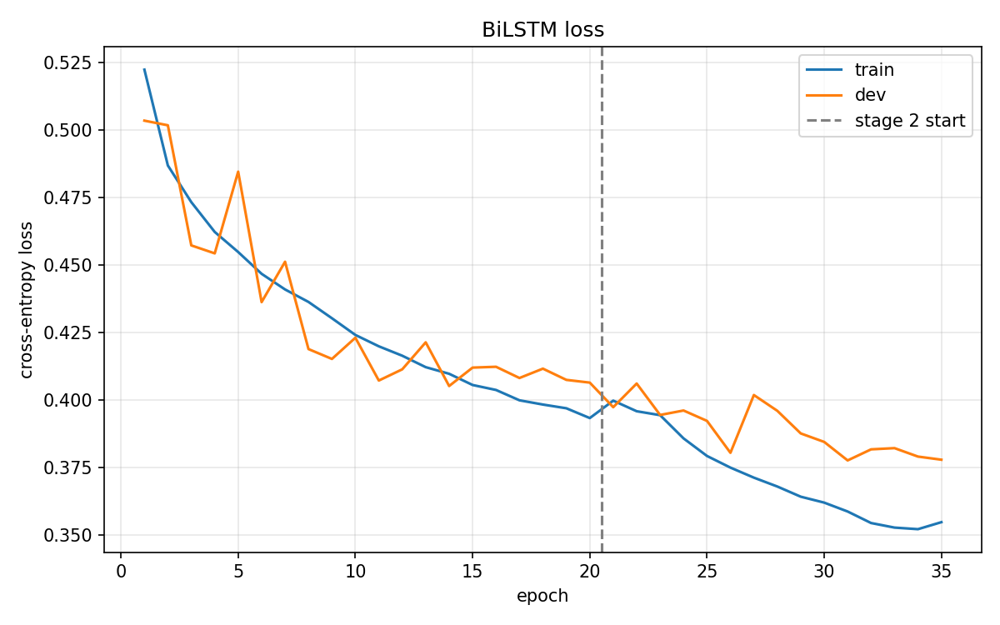
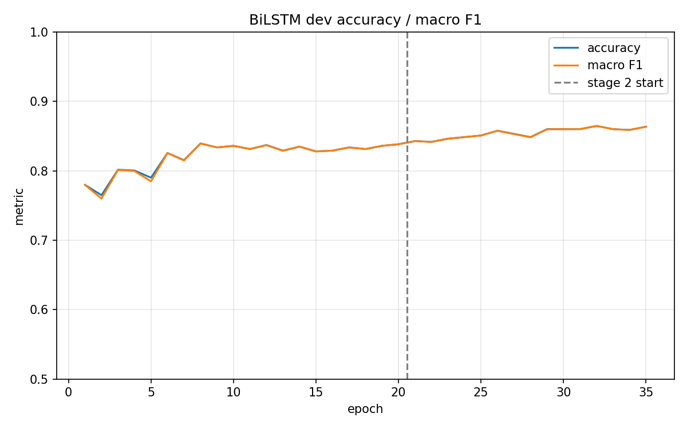
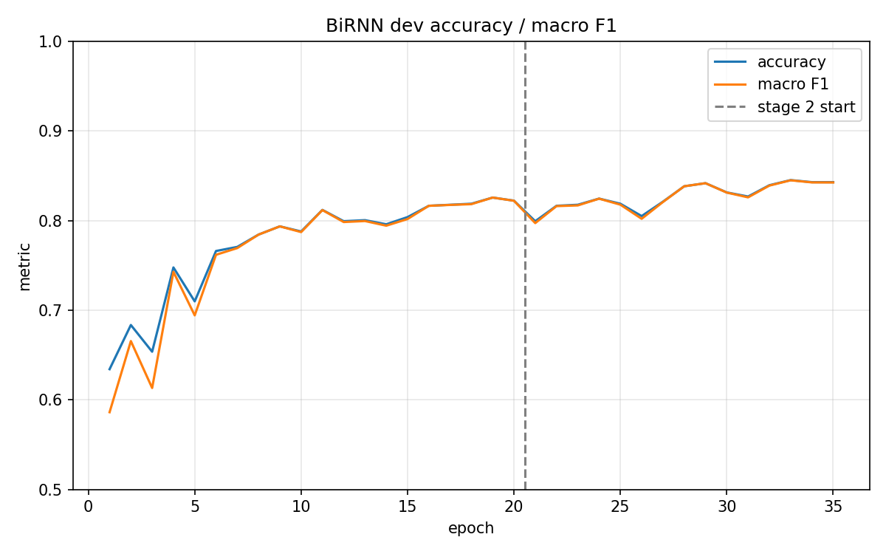
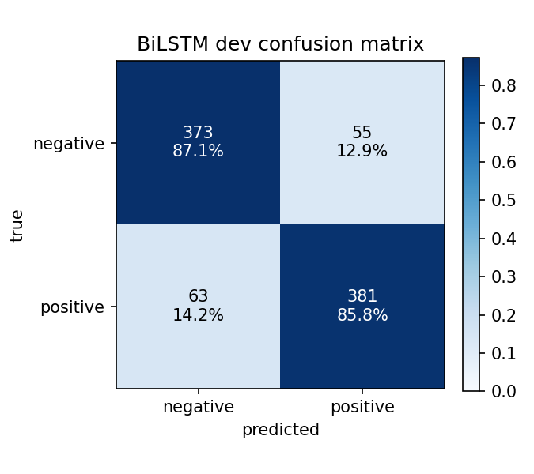

# RNN Text Classification on SST-2

基于 **GloVe embedding + BiRNN / BiGRU / BiLSTM + pooling classifier** 的句子级情感分类实验。

这是本仓库的第一个 text 项目。任务从「给每个像素分类」变成「给每个句子分类」，数据管线整体换形（变长序列、词表、动态 padding、packing），但训练框架完全沿用 CNN 项目：同样的两阶段分层学习率微调、同样的 per-epoch JSON 日志与曲线、同样的按指标选 best checkpoint 协议。在这里扮演 ImageNet 预训练 backbone 角色的是 **GloVe 词向量表**——stage 1 冻结（让 RNN 学会读固定词向量），stage 2 以极小学习率解冻（让词向量本身适应情感任务）。

本轮实验的目的是**在充分训练的前提下比较三种循环单元**：vanilla RNN、GRU、LSTM，除 `--cell` 外所有条件完全一致。

---

## 实验结果

| 指标 | 结果 |
|---|---:|
| Dev Accuracy | **0.8647** |
| Macro F1 | **0.8647** |
| 最佳 epoch | **32 / 35** |
| 模型参数量 | **3.70M**（其中 embedding 1.38M） |
| 训练时间 | **8.0 分钟**（35 epochs，单卡） |

> SST-2 的 `test.tsv` 不带标签（GLUE 服务器评测），所以本文所有数字——和几乎所有 SST-2 论文一样——都是 **dev（872 句）** 上的结果。

最佳配置：`BiLSTM + GloVe 6B.100d + last pooling`，两阶段 20 + 15 epochs。

---

## 三种 cell 对比

完全单变量：同一词表（13,846）、同一 GloVe 初始化、同一 last pooling、同一 loss、同一 20 + 15 epochs 调度、同一 seed（42），只换 `--cell`。

| 模型 | Dev Acc | Macro F1 | 最佳 epoch | 总参数 | encoder 参数 | s / epoch | 总时长 |
|---|---:|---:|---:|---:|---:|---:|---:|
| BiRNN（vanilla） | 0.8452 | 0.8450 | 33 | 1.96M | 0.58M | 13.1 | 7.6 min |
| BiGRU | 0.8498 | 0.8497 | 27 | 3.12M | 1.73M | 12.7 | 7.4 min |
| **BiLSTM** | **0.8647** | **0.8647** | 32 | 3.70M | 2.31M | 13.6 | 8.0 min |

**LSTM > GRU > RNN**，与教科书顺序一致。但真正有信息量的不是这个排序，而是下面四个观察。

### 1. 差距主要体现在收敛速度，而不是终点

三条曲线在 stage 1（前 20 轮）内到达 0.82 的时间完全不同：

```text
BiLSTM  epoch  8 -> 0.8394       stage 1 峰值，之后基本走平
BiGRU   epoch 12 -> 0.8314       stage 1 峰值
BiRNN   epoch 19 -> 0.8257       stage 1 峰值，到最后一轮还在爬
```

**LSTM 用 8 轮达到的水平，vanilla RNN 用满 20 轮也没追上。** 终点差距只有 1.95 个百分点，但达到同一水平所需的轮数差了 2 倍以上——如果只跑 12 轮（上一轮的 sanity 预算），得到的排序差距会被显著放大。这是"充分训练"这个前提为什么重要的直接证据。

### 2. vanilla RNN 前期严重震荡

```text
BiRNN  前 5 轮 dev acc: 0.6342  0.6835  0.6537  0.7477  0.7099
BiGRU  前 5 轮 dev acc: 0.7787  0.7798  0.8188  0.7901  0.7844
BiLSTM 前 5 轮 dev acc: 0.7798  0.7649  0.8016  0.8005  0.7901
```

RNN 第 1 轮只有 0.6342（GRU/LSTM 已经 0.78），而且第 3、5 轮出现明显回撤。梯度裁剪（`GRAD_CLIP=5.0`）挡住了发散，但挡不住这种震荡——这正是 BPTT 中重复连乘同一个循环 Jacobian 的后果，也是门控结构要解决的问题。

### 3. Stage 2 解冻词向量：只有 RNN 受到冲击

stage 1 最后一轮 → stage 2 第一轮（epoch 20 → 21）：

| 模型 | acc | train loss | dev loss |
|---|---|---|---|
| BiRNN | 0.8222 → **0.7993** | 0.4388 → 0.4529 | 0.4350 → **0.4782** |
| BiGRU | 0.8234 → 0.8314 | 0.3837 → 0.3890 | 0.4173 → 0.4087 |
| BiLSTM | 0.8383 → 0.8429 | 0.3933 → 0.3997 | 0.4064 → 0.3973 |

两个门控模型平稳过渡甚至直接提升，只有 vanilla RNN 掉了 2.3 个点（三轮后才恢复）。原因是 stage 2 同时发生三件事：词向量开始移动、optimizer 重建（Adam 动量清空）、学习率从 stage 1 末的余弦低点跳回 3e-4。门控单元对输入分布的这种扰动更鲁棒；RNN 的隐状态直接由 `tanh(Wx + Uh)` 决定，输入一动整条轨迹就跟着动。

（对比分割项目：DeepLabv3+ 在 stage 2 起点 mIoU 从 0.7190 掉到 0.6636，那是解冻带 BatchNorm 的卷积 backbone 导致 running statistics 被扰动。这里解冻的只是一张查表，没有 running statistics，所以冲击小得多，且只对最脆弱的 cell 可见。）

### 4. GRU 训练损失最低，泛化却不如 LSTM

最后一轮（epoch 35）的 train / dev loss：

| 模型 | train loss | dev loss | gap |
|---|---:|---:|---:|
| BiRNN | 0.3769 | 0.4062 | 0.029 |
| BiGRU | **0.3413** | 0.4044 | **0.063** |
| BiLSTM | 0.3547 | **0.3779** | 0.023 |

GRU 把训练损失压得最低，dev 损失却比 LSTM 高 0.027——**它更快地开始记住训练集**。LSTM 用略高的训练损失换来了明显更好的 dev 表现，这在 67k 条短片段这种容易过拟合的规模上是有利的性质。

另外，三者的**每轮耗时几乎相同**（12.7 ~ 13.6 秒），尽管 LSTM 的 encoder 参数是 RNN 的 4 倍。瓶颈在序列的时间步数（无法并行）而不是每步的浮点运算量，cuDNN 的融合核把三者的差异抹平了——所以在这个规模下，**选 LSTM 不需要付出速度代价**。

---

## 数据集

- **训练集**：SST-2 train（GLUE 版），67,349 条
- **验证集**：SST-2 dev，872 条
- **测试集**：1,821 条，**无标签**（GLUE 服务器评测，本项目不使用）
- **类别数**：2（negative / positive）
- **标签分布**：train 29,780 / 37,569（44% / 56%），dev 428 / 444

文本统计（train，用本项目 tokenizer）：

```text
句长  mean=9.9  median=7  p90=22  max=54
词表  13,846（min_freq=1，仅用 train 构建）
GloVe 覆盖率  13,554 / 13,846 = 97.89%
dev <unk> 率  4.75%
```

训练集里大量样本是 treebank 切出来的**短语片段**（`hide new secretions from the parental units`），而 dev 是完整句子——这是 GLUE 官方划分的固有特点。两者的长度分布差异很大：

```text
          mean   median   ≤3 词占比
train      9.9      7       25.5%
dev       20.4     20        0.3%
```

模型主要在短片段上训练，却在长句上被评测。这个错配值得记住，它是后面「已知限制」里几条的根源。

数据处理：

- tokenize：小写 + 正则切分（标点独立成 token）
- 词表只用 **train** 构建，dev/test 未见词映射到 `<unk>`
- 截断长度 64（SST-2 最长 54，实际不触发；为 `predict.py` 的自由文本准备）
- **动态 padding**：每个 batch 只补到「该 batch 内最长句」，不是补到 64

---

## 模型结构

```text
ids [B, L] + lengths [B]          动态 padding，PAD = 0
│
├── TokenEmbedding                「backbone」
│     ├── nn.Embedding(13846, 100), padding_idx=0
│     │     └── GloVe 6B.100d 初始化，未命中词 N(0, 0.1)
│     └── dropout 0.5
│           vectors [B, L, 100]
│
├── RNNEncoder                    「neck」
│     ├── pack_padded_sequence(lengths, enforce_sorted=False)
│     ├── 2-layer Bi{RNN|GRU|LSTM}, hidden 256 / 方向
│     │     └── layer 间 dropout 0.5
│     └── pad_packed_sequence
│           outputs [B, L, 512]   final [B, 512]
│
└── ClassifierHead                「head」
      ├── pooling: last（本轮实验使用）/ max / mean（后两者按 lengths 做 mask）
      ├── dropout 0.5
      └── Linear 512 → 2
            logits [B, 2]
```

### Packing 为什么是必须的

padding 后的 batch 是个矩形，但里面的句子不是。如果把 `<pad>` 直接喂进循环，句子结束后隐状态还会继续被更新 `k` 步——「最后一个隐状态」就变成了「补了 k 个 pad 之后的状态」，同一个句子在不同 batch 里会得到不同的表示。`pack_padded_sequence` 让每一行恰好走 `length` 步。

`model/encoder.py` 的自检直接验证了这三条性质：

```text
padded positions zero: True
final == output at last real token: True
invariant to extra padding: True
```

最后一条是关键：给同一批句子多补 4 列 padding，输出必须逐位相同。

### Masked pooling

`max` pooling 在 reduce 之前把 padding 位置置为 `-inf`，`mean` 除以真实长度而不是 `L`。不做 mask 的话，padding 位置的 0 会在全负激活时赢下 max——这类 bug 不会报错，只会让准确率随 batch 组成悄悄浮动。

---

## 参数量

embedding 和 head 在三个模型间完全相同，差异全部来自 encoder：

| 模块 | BiRNN | BiGRU | BiLSTM |
|---|---:|---:|---:|
| Embedding（13,846 × 100） | 1.38M | 1.38M | 1.38M |
| Encoder（2 层，hidden 256，双向） | 0.58M | 1.73M | 2.31M |
| Classifier head（512 → 2） | 1.03K | 1.03K | 1.03K |
| **总计** | **1.96M** | **3.12M** | **3.70M** |

比例正是门数：RNN 每层 1 组权重，GRU 3 组，LSTM 4 组。

Stage 1 可训练参数 = 总数 − 1.38M（embedding 冻结）；Stage 2 全部解冻。

head 只有 1K 参数是刻意的：在 512 维句向量 + 67k 训练样本的规模下，再加一层 MLP 只会增加过拟合，容量应该放在 encoder 里。

---

## 训练配置

| 项目 | 配置 |
|---|---|
| Batch size | 64 |
| Optimizer | Adam |
| Weight decay | 1e-4 |
| Scheduler | CosineAnnealingLR（每个 stage 独立） |
| **Gradient clipping** | **5.0（全局范数）** |
| Label smoothing | 0.05 |
| Dropout | 0.5（embedding / RNN 层间 / 分类前） |
| Seed | 42 |
| Stage 1 epochs | 20 |
| Stage 2 epochs | 15 |

梯度裁剪是相对 CNN 项目**新增且不可省**的一项：BPTT 会把同一个循环 Jacobian 连乘 T 次，单个 batch 就可能产生一个大到抹掉一整个 epoch 进展的梯度。

### Stage 1：冻结词向量

```text
冻结: embedding
训练: encoder + head
学习率: head 1e-3, encoder 1e-3    （两者都是随机初始化，同一档）
```

### Stage 2：解冻，分层学习率

```text
学习率: head 3e-4, encoder 3e-4, embedding 5e-5
```

embedding 用小 6 倍的学习率，是为了让预训练词向量「漂移」而不是被冲垮。

### 复现命令

```bash
python train.py --cell rnn  --epochs-stage1 20 --epochs-stage2 15 --output-dir outputs_rnn_full
python train.py --cell gru  --epochs-stage1 20 --epochs-stage2 15 --output-dir outputs_gru_full
python train.py --cell lstm --epochs-stage1 20 --epochs-stage2 15 --output-dir outputs_lstm_full
```

首次运行会自动下载 SST-2（7 MB）与 GloVe（862 MB zip，多连接断点续传），无需手动准备数据。

评估与推理：

```bash
python eval.py --weights outputs_lstm_full/best.pt --save-cm
python predict/predict.py --weights outputs_lstm_full/best.pt --dev-mistakes 15
python predict/predict.py --weights outputs_lstm_full/best.pt --text "a charming, funny film"
```

---

## 训练曲线

### BiLSTM Loss



### BiLSTM Accuracy / Macro F1



### BiRNN Accuracy（对比：前期震荡）



### 曲线分析

**BiLSTM**：stage 1 在 epoch 8 达到 0.8394 后进入平台期（0.828 ~ 0.839 之间摆动 12 轮），stage 2 解冻词向量后重新开始上升，epoch 26 突破 0.8578，epoch 32 达到最佳 0.8647。**stage 2 净贡献 +2.5 个百分点**——这是本轮实验里两阶段协议价值最直接的证据：词向量停止冻结之后，模型还有很大提升空间。

末尾 7 轮 dev acc 在 0.859 ~ 0.865 之间波动，train loss 0.3547 / dev loss 0.3779 差距仅 0.023，说明 35 轮这个预算基本训到位了——既没有明显欠拟合，也没有进入过拟合。

**BiRNN**：整条曲线都更低更抖，stage 2 起点还有一次明显回撤，直到 epoch 28 之后才稳定在 0.83 以上。它在最后一轮仍在缓慢上升（0.8429），是三者中唯一可能还没完全收敛的。

---

## 完整验证集结果

### BiLSTM（最佳模型）

| Class | Precision | Recall | F1 | Support |
|---|---:|---:|---:|---:|
| negative | 0.8555 | 0.8715 | 0.8634 | 428 |
| positive | 0.8739 | 0.8581 | 0.8659 | 444 |
| **accuracy** | | | **0.8647** | 872 |



### 三个模型的混淆矩阵对比

```text
              BiRNN                 BiGRU                BiLSTM
          pred_neg pred_pos    pred_neg pred_pos    pred_neg pred_pos
true_neg     352      76          377      51          373      55
true_pos      59     385           80     364           63     381
```

三者的**错误偏向不同**：

| 模型 | negative recall | positive recall | 偏向 |
|---|---:|---:|---|
| BiRNN | 0.8224 | 0.8671 | 偏向判正面 |
| BiGRU | 0.8808 | 0.8198 | 偏向判负面 |
| BiLSTM | 0.8715 | 0.8581 | 最均衡 |

GRU 把 80 条正面判成负面（三者最多），RNN 则把 76 条负面判成正面。LSTM 两侧误差最接近（55 / 63）。三者 macro F1 与 accuracy 的差都在 0.0002 以内，说明没有严重的类别失衡问题——但这种系统性偏向说明单一 seed 下的模型行为差异不只是随机噪声，值得多 seed 验证。

---

## 实验结论

1. **门控结构在充分训练下仍然领先。** BiLSTM 0.8647 > BiGRU 0.8498 > BiRNN 0.8452，LSTM 领先 GRU 1.49 个点、领先 vanilla RNN 1.95 个点。
2. **收敛速度的差距远大于终点差距。** LSTM 8 轮达到的水平，vanilla RNN 跑满 20 轮 stage 1 也没追上。短预算实验会高估终点差距、低估效率差距。
3. **vanilla RNN 的不稳定性是可观测的**，不只是理论问题：前 5 轮剧烈震荡，stage 2 解冻时掉 2.3 个点，而两个门控模型平稳过渡。
4. **LSTM 比 GRU 更抗过拟合。** GRU 的 train loss 最低（0.3413）但 dev loss 更高，train/dev gap 是 LSTM 的近 3 倍。
5. **速度上没有代价。** 三者每轮耗时 12.7 ~ 13.6 秒，参数量差 1.9 倍但时间几乎相同——循环网络的瓶颈是时间步数不是 FLOPs。
6. **两阶段协议在文本上有明确收益。** BiLSTM 的 stage 2 贡献了 +2.5 个百分点，且没有出现分割项目里那种解冻冲击（例外是 vanilla RNN）。

---

## 已知限制

- **单 seed 单次运行。** `train.py` 目前没有 `--seed` 参数（`config.SEED` 写死为 42）。GRU 与 RNN 只差 0.46 个百分点，很可能落在运行间波动范围内，**"GRU > RNN" 这一条结论不可靠**；LSTM 的 1.49 领先相对更可信，但同样需要多 seed 确认。
- **dev 既用于选 checkpoint 又用于报告**，数字略偏乐观。这是 SST-2 的通病（test 标签不公开），但应当明确说出来。
- **只测了 last pooling。** max / mean pooling 已实现但本轮未做对照。
- **没有 GloVe 消融。** 「预训练词向量值多少分」这个问题本轮没有答案。
- **没有非 RNN 下界 baseline**（bag-of-words 逻辑回归 / TextCNN），因此无法判断 RNN 结构本身贡献了多少。
- GloVe 只用了 100d，未试 300d。
- 训练/评测长度分布错配（train 中位 7 词、dev 中位 20 词）未做任何处理。
- 未做 early stopping，轮数靠手动指定。

### 代码已知问题

- **`training_log.json` 里的 `meta.started` 实际是训练结束时间**：`collect_run_meta()` 在训练后才被调用，里面的 `time.strftime` 记的是那一刻。要看真实起止时间，用 `history[0].timestamp` 和 `history[-1].timestamp`。
- **`outputs_rnn_full` 的日志用的是旧字段名** `train_total` / `val_total`，另外两个是 `train_loss` / `val_loss`（loss 的计算方式没变，数值可比）。`plot_curves` 两种都兼容。
- **tokenizer 会切碎带重音的词**：`soufflé` → `['souffl', 'é']`，而 GloVe 里其实有 `soufflé`。影响面很小（个位数量级的词）。
- **`predict.py` 对未预分词的用户输入存在 train/serve 偏差**：语料是 PTB 预分词的（`do n't`），而用户直接输入 `don't` 会被当成一个 token 并落到 `<unk>`——恰好丢掉否定词。
- **`--no-glove` 分支的 embedding 初始化尺度不一致**：走的是 `nn.Embedding` 默认的 `N(0,1)`（每维 std 1.00），而 GloVe 向量实际 std 约 0.53，未命中词是 `N(0,0.1)`。做 GloVe 消融前需要先统一。

---

## 下一步

### 1. 多 seed 复现

给 `train.py` 加 `--seed`，每个 cell 跑 3 个 seed，报告均值 ± 标准差。当前 GRU 与 RNN 的 0.46 个点差距在统计上没有意义，这是最优先要补的。

### 2. 补下界 baseline

同一份数据、同一份词表，跑 bag-of-words 逻辑回归。如果 BiLSTM 只赢它几个点，那才是关于「循环结构值多少分」的诚实答案。

### 3. GloVe 消融（先修初始化）

统一随机初始化尺度后再跑 `--no-glove`，量化预训练词向量的贡献。

### 4. Attention pooling

在现有 encoder 输出 `[B, L, 512]` 上加一层可学习 attention 汇聚，替换 last。这是从「加权词典」走向「组合语义」的最小改动，也是通往 Transformer 的自然一步。重点观察否定、转折、反讽这三类句式是否改善（用 `predict.py --dev-mistakes` 对比）。

### 5. TextCNN 对比

同一 pipeline，只把 `model/encoder.py` 换成多尺度 1D 卷积。n-gram 特征 vs 循环状态，在中位长度 7 词的语料上很可能打平——这个结果本身就有价值。

### 6. 后续学习路线

```text
SST-2 (RNN)  →  SST-2 (Attention / Transformer encoder)  →  BERT fine-tune
```

---

## 文件结构

```text
config.py                 # 全部超参与路径；cell / pooling / 两阶段调度
dataset/
├── vocab.py              # tokenizer + Vocab（build / encode / save / load）
├── sst2.py               # 下载、tsv 解析、Dataset、collate_fn（动态 padding）
└── glove.py              # GloVe 下载 + 按词表构建 embedding 矩阵
model/
├── embedding.py          # 词向量表（GloVe 初始化 + freeze/unfreeze）
├── encoder.py            # RNN / GRU / LSTM 编码器（packing）
├── head.py               # masked pooling + 线性分类器
└── rnn_classifier.py     # 整体拼装 + parameter_groups（三档学习率）
losses/
└── cls_loss.py           # 交叉熵 + label smoothing
utils/
├── download.py           # 多连接断点续传下载器
├── metrics.py            # 混淆矩阵 → accuracy / precision / recall / F1
└── viz.py                # 预测行渲染 + 混淆矩阵热力图
train.py                  # 训练入口（两阶段分层学习率）
eval.py                   # 评估入口（per-class 报告 + 混淆矩阵）
predict/predict.py        # 推理入口（自由文本 / dev 采样 / 错误分析）
```

每个模块底部都带一个可直接运行的自检，用于单独验证该文件的行为：

```bash
python dataset/vocab.py       # tokenize / 词表构建 / min_freq 剪枝
python model/encoder.py       # packing 的三条不变性
python model/head.py          # masked pooling 的手算结果
python utils/metrics.py       # 手算可验证的 P/R/F1
python dataset/sst2.py        # 语料统计 + collate 检查
python dataset/glove.py       # 词表覆盖率 + 词向量语义检查
```

## 输出文件

每个训练目录（`outputs_<cell>_full/`）包含：

```text
best.pt                   # dev accuracy 最佳的 checkpoint（不入库，*.pt 已 ignore）
last.pt                   # 最后一轮（可安全删除）
vocab.json                # 与该 checkpoint 配套的词表（不入库；缺失时会由
                          # train.tsv 确定性重建，见 eval.py 的提示）
training_log.json         # meta（完整配置快照）+ 每轮历史 + 最终 per-class 报告
loss_curve.png
acc_curve.png
confusion_matrix.png
```

`eval.py` 与 `predict/predict.py` 会自动从 `training_log.json` 读回该 checkpoint 的模型结构（cell / pooling / 宽度），因此不依赖 `config.py` 是否被改过。
